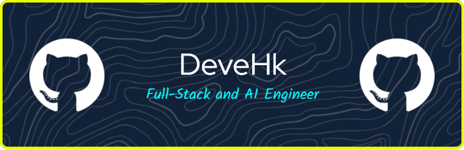

  

<h1 align="center">
  Hey , I'm Harsh Kumar!
</h1>

---

## 🚀 About Me  

#### I'm a **Full-Stack Developer & AI Enthusiast** from India. I build intelligent, scalable applications and love solving challenging problems with technology.  

---
### 🚀 **SDE Intern @ Amazon India** _(Present)_

### 🧠 **Fullstack & AI Developer Intern @ Infiny.ai** _(Past)_

### 🎯 **SDE Extern @ AlgoUniversity** _(Past)_
---

- 🔭 **Current Work:** AI-driven solutions, Web & System Development  
- 🌱 **Learning:** Hybrid Retrieval, RAG, Multi-agent LLMs, Distributed Systems  
- 💻 **Tech Stack:** MERN, Next.js, Tailwind, Go, Python, OpenAI API  
- 🎓 **Education:** B.Tech in Computer Science (AI specialization)  
- 🤝 **Looking for:** Collaborations on AI & Web-based projects  
- 📬 **Reach me at:**   

---

## 📊 GitHub Stats  

  
  
  

  
